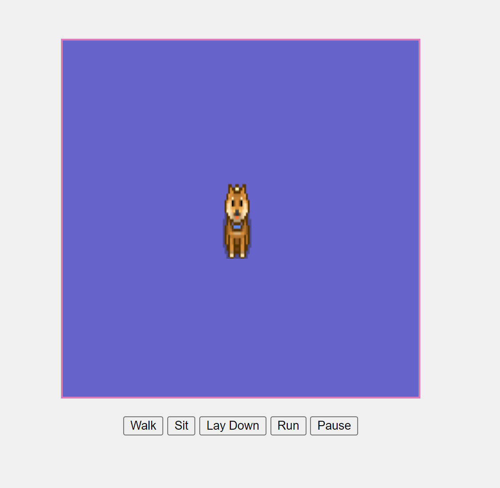

# MyDigitalDog

A project featuring animated dog sprites with multiple actions. Users can control the dog’s movements—walking, sitting, laying down, and running—by using buttons to trigger each animation. The animations are created by cycling through multiple frames in a sprite sheet

